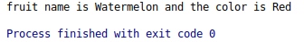
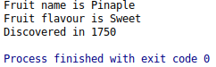
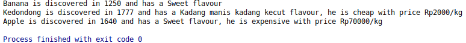
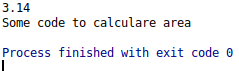

### Object Oriented Programming Dart
Object-oriented is a software development method that has been widely used by developers. The advantages of OOP are as organizers and making rules about the system in which making code more eficient

## Classes
Is a blue print from object that used to separate some line code to spesific class that could be call in main function/class.

Here the example class

```dart
class fruit {
  //
  String name = 'Watermelon';
  String color = 'Red';

//  declare function in fruit class
  void showfruit() {
    print('fruit name is ${name} and the color is ${color}');
  }
}
```

To use the class fruit :
```dart
void main() {
  //Main Class
  fruit f1 = new fruit();

  //Call function
  f1.showfruit();
}
```
**Result :**



### Constructors
When object is created for the first time it's gonna runed by constructor.

```dart
void main() {
  //Main Class
  fruit f1 = new fruit('Watermelon', 'Sweet');
}

//Secondary class
class fruit {
  //constructor(default)
  fruit(String name, String flafour) {
    print('fruit name is ${name} with the flafout ${flafour}');
  }
}
```

### Setter Getter
How to set and get the value of some variable ? here is it.

```dart
void main() {
  //Main Class
  fruit f1 = new fruit();
  f1.name = 'Pinaple';
  f1.flavour = 'Sweet';
  f1.discovered = 1750;

  print('Fruit name is ${f1.name}');
  print('Fruit flavour is ${f1.flavour}');
  print('Discovered in ${f1.discovered}');
}

//Secondary class
class fruit {
  String name;
  String flavour;
  int discovered;

  //getter
  String get fruitName {
    return name;
  }

  String get fruitFlavour {
    return flavour;
  }

  int get fruitDiscovered {
    return discovered;
  }

//  setter
  void set fruitName(String name) {
    this.name = name;
  }

  void set fruitFlavour(String flavour) {
    this.name = flavour;
  }

  void set fruitDiscovered(int discovered) {
    this.discovered;
  }
}
```
**Result :**



### Inheritance
This is one of the beauty part of OOP, you can access use variable in new class without declarate the variable it self with **Inheritance** . Inheritance can minimize your line of code.

**Let's Jump in!** 
Schenario : We have *main.dart* as main class and *fruits.dart* as secondary class. In *fruit.dart* class we have ``name``, ``flavour``, and ``discovered`` variable with function ``showDetailFruit``. So we gonna make two class that could inherit the variables from *fruit.dart* class and we named them *cheapFruit* and *expensiveFruit*. 

Here is the code : 

```dart
//Main class
void main() {
  //declarate object of fruit class
  var fruit3 = new fruits();
  fruit3.name = 'Banana';
  fruit3.flavour = 'Sweet';
  fruit3.discovered = 1250;
  //call function
  fruit3.showDetailFruit();

  //declarate object at inherit class (cheap fruit)
  var cheapFruit1 = new cheapFruit();
  cheapFruit1.name = 'Kedondong';
  cheapFruit1.flavour = 'Kadang manis kadang kecut';
  cheapFruit1.discovered = 1777;
  cheapFruit1.cpPrice = 2000;
  //call function
  cheapFruit1.showCheapFuitPrice();

  //declarate object at inherit class (expensive fruit)
  var expensiveFruit1 = new expensiveFruit();
  expensiveFruit1.name = 'Apple';
  expensiveFruit1.flavour = 'Sweet';
  expensiveFruit1.discovered = 1640;
  expensiveFruit1.exPrice = 70000;
  //call function
  expensiveFruit1.showExpensiveFruitPrice();
}

//Secondary class
class fruits {
  String name;
  String flavour;
  int discovered;

  void showDetailFruit() {
    print('$name is discovered in $discovered and has a $flavour flavour');
  }
}

//Inherit class from class fruits
class cheapFruit extends fruits {
  int cpPrice;

  void showCheapFuitPrice() {
    //this method use the variable of fruits class(name, discovered, flavour)
    print(
        '$name is discovered in $discovered and has a $flavour flavour, he is cheap with price Rp$cpPrice/kg');
  }
}

//Inherit class from class fruits
class expensiveFruit extends fruits {
  int exPrice;

  void showExpensiveFruitPrice() {
    //this method use the variable of fruits class(name, discovered, flavour)
    print(
        '$name is discovered in $discovered and has a $flavour flavour, he is expensive with price Rp$exPrice/kg');
  }
}
```
**Here is how it's look :**




### Static Method and Variables
Static is generaly used for members/variables that have a static value. We cannot access the static members/variables by using the class object. So what's the advantages of using *static* keyword? 
- Make instance variables and method more simple
- Minimalize memory used, the less memory used the faster it's perform (for cheap laptop should notice this hahaha).

Also to use static members/variables we should use *static* keyword before *void #nameMethod*.

```dart
//Main Class
void main() {
  circle.pi;
  print(circle.pi);

  //execute static method
  circle.calculateArea();
}

//Secondary Class
class circle {
  //declarate static member/variable
  static double pi = 3.14;

  //declarare static method
  static void calculateArea() {
    print('Some code to calculare area');
  }
}
```
**Result**




