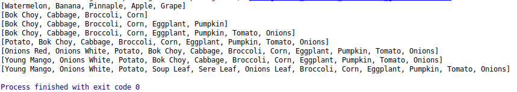
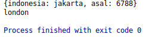
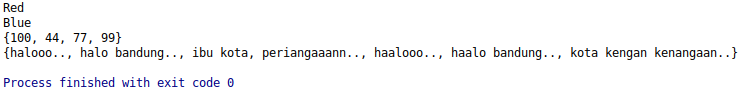

# Data Structure, Collections and Generics

### List
List is used to store some data. Read the comment at line of code for a better understand yoo.

**Here we go :**

```dart
void main() {
  //Fixed leght List(List length can't change at runtime)
  //declaring a list
  var fruitList = new List(5);
  //initializing a list
  fruitList[0] = 'Watermelon';
  fruitList[1] = 'Banana';
  fruitList[2] = 'Pinnaple';
  fruitList[3] = 'Apple';
  fruitList[4] = 'Grape';
  print(fruitList);

  //Growable List(List length can change at runtime)
  var vegetablesList = ['Bok Choy', 'Cabbage', 'Broccoli', 'Corn'];
  print(vegetablesList);
  //add 2 values to list using (.add) function
  vegetablesList.add('Eggplant');
  vegetablesList.add('Pumpkin');
  print(vegetablesList);
  //add all values to list using (.addAll) function
  vegetablesList.addAll(['Tomato', 'Onions']);
  print(vegetablesList);
  //add element/value to specific position using(insert()) function
  vegetablesList.insert(0, 'Potato');
  print(vegetablesList);
  //add multiple elements/values to specific position using(insertAll()) function
  vegetablesList.insertAll(0, ['Onions Red', 'Onions White']);
  print(vegetablesList);

  //updating index
  vegetablesList[0] = 'Young Mango';
  print(vegetablesList);
  //replace range using(replaceRange()) function
  vegetablesList.replaceRange(3, 5, ['Soup Leaf', 'Sere Leaf', 'Onions Leaf']);
  print(vegetablesList);
  //Remove ??? Come back later...
}
```
**Result :**



### Map

The Map object is a simple key/value pair. Keys and values in a map may be of any type. A Map is a dynamic collection. In other words, Maps can grow and shrink at runtime. 

```dart
//Map
void main(List<String> arg) {
  //initializing map
  Map capital = {
    101: {"indonesia": "jakarta", "asal": "6788"},
    102: {"malaysia": "kuala lumpur", "asal": "6788"},
    103: {"japan": "tokyo", "asal": "6788"},
    104: {"england": "london", "asal": "6788"},
    105: {"germany": "berlin", "asal": "6788"}
  };

//  var showList = capital;
  print(capital[101]);

  //another way to initialize a map
  Map user = {
    "aku": "jakarta",
    "kamu": "kuala lumput",
    "dia": "tokyo",
    "mereka": "london",
    "kami": "berlin"
  };

  var showUser = user;
  print(showUser['mereka']);
}
```


### Set

Set represents a collection of objects in which each object can occur only once. The dart:core library provides the Set class to implement the same.

```dart
void main() {
  //Set from list
  Set awarna = new Set.from(["Red", "Blue", "Gree"]);
  Set bwarna = new Set.from(["Black", "Red", "Blue"]);

  Set abwarna = bwarna.intersection(awarna); //interception => menggabungkan
  for (String warna in abwarna) {
    print(warna);
  }

  //Empty set number
  Set numberSet = new Set();
  numberSet.add(100);
  numberSet.add(44);
  numberSet.add(77);
  numberSet.add(99);
  print(numberSet);

  //Empty set String
  Set haloBandung = new Set();
  haloBandung.add('halooo..');
  haloBandung.add('halo bandung..');
  haloBandung.add('ibu kota');
  haloBandung.add('periangaaann..');
  haloBandung.add('haalooo..');
  haloBandung.add('haalo bandung..');
  haloBandung.add('kota kengan kenangaan..');
  print(haloBandung);
}
```
**Result : yeah**


