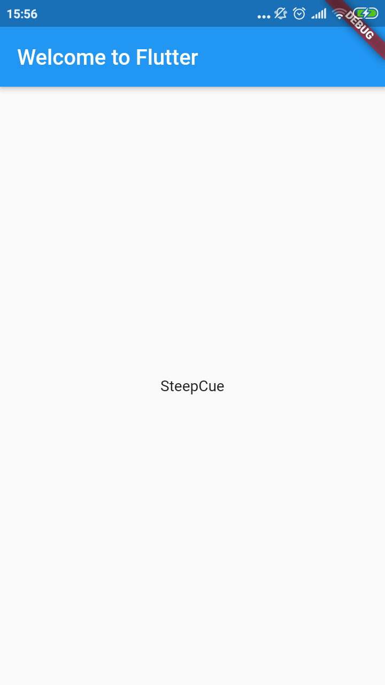
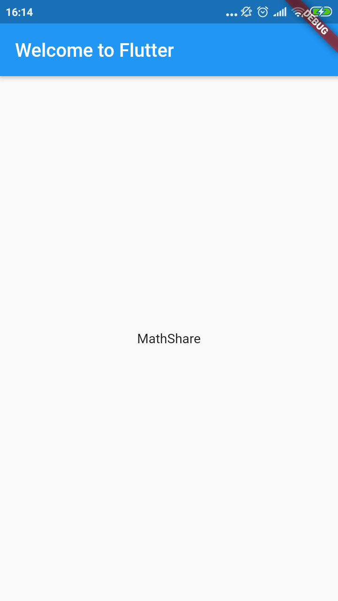
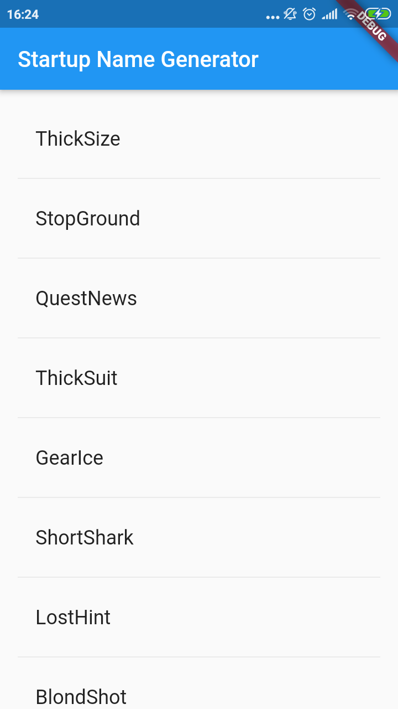
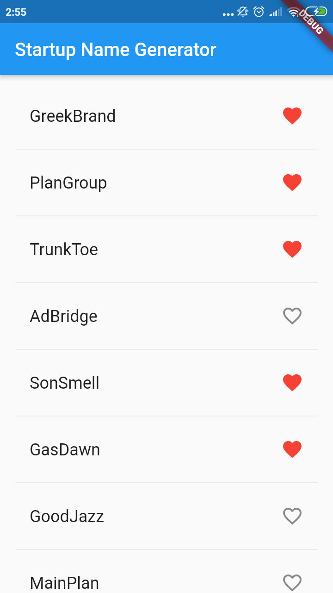
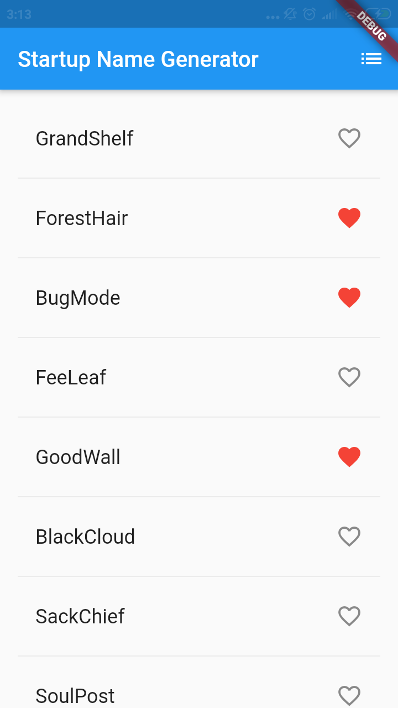
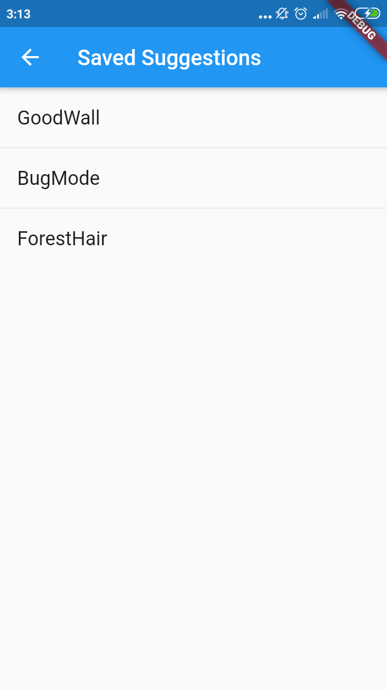
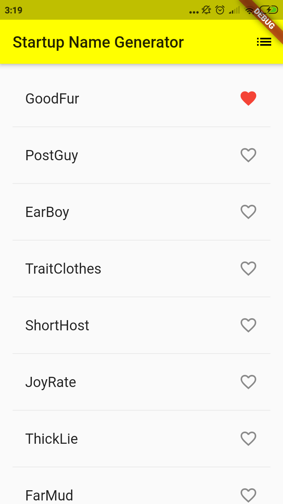

# Start With Flutter
### Run Hello World App

```dart
import 'package:flutter/material.dart';

void main() => runApp(MyApp());

class MyApp extends StatelessWidget {
  @override
  Widget build(BuildContext context) {
    return MaterialApp(
      title: 'Welcome to Flutter',
      home: Scaffold(
        appBar: AppBar(
          title: Text('Welcome to Flutter'),
        ),
        body: Center(
          child: Text('Hello World'),
        ),
      ),
    );
  }
}
```
Here is the result :




### Use External Package

Step :
    - The pubspec file manages the assets and dependencies for  a Flutter app. In pubspec.yaml, add english_words (3.1.0 or higher) to the dependencies list:
    - Tap *Package Get*
    - Import new Package
    - Replace hello word to to use package with this code
```dart
class MyApp extends StatelessWidget {
  @override
  Widget build(BuildContext context) {
    final wordPair = WordPair.random(); //Add this line uto use english word package
    return MaterialApp(
      title: 'Welcome to Flutter',
```

Here is the result :




### Add Stateful Widget
Stateless widgets are immutable, meaning that their properties can’t change—all values are final.

Stateful widgets maintain state that might change during the lifetime of the widget. Implementing a stateful widget requires at least two classes: 1) a StatefulWidget class that creates an instance of 2) a State class. The StatefulWidget class is, itself, immutable, but the State class persists over the lifetime of the widget.

    - Create a minimal state class. Add the following to the bottom of main.dart:
    - Add the stateful RandomWords widget to main.dart. The RandomWords widget does little else beside creating its State class:
    - Add the build() method to RandomWordsState:
    - Remove the word generation code from MyApp by making the changes shown in the following diff:
    - Restart App yeah

### Create an Infinite Scrolling ListView
    - Add a _suggestions list to the RandomWordsState class for saving suggested word pairings. Also, add a _biggerFont variable for making the font size larger.
    - Add a _buildSuggestions() function to the RandomWordsState class:
    - Add a _buildRow() function to RandomWordsState:
    - In the RandomWordsState class, update the build() method to use _buildSuggestions(), rather than directly calling the word generation library. (Scaffold implements the basic Material Design visual layout.) Replace the method body with the highlighted code:
    - In the MyApp class, update the build() method by changing the title, and changing the home to be a RandomWords widget:
    - Restart app yeah

Here is the result :



## Part 2

You'll start with a simple mobile app that generates an endless list of proposed names for a startup company. By the end of this codelab, the user can select and unselect names, saving the best ones. Tapping the list icon in the upper right of the app bar navigates to a new page (called a route) that lists only the favorited names.

### Add icons to the list

Add a _saved Set to RandomWordsState. This Set stores the word pairings that the user favorited. Set is preferred to List because a properly implemented Set does not allow duplicate entries.

```dart
class RandomWordsState extends State<RandomWords> {
  final List<WordPair> _suggestions = <WordPair>[];
  final Set<WordPair> _saved = Set<WordPair>();   // Add this line.
  final TextStyle _biggerFont = TextStyle(fontSize: 18.0);
  ...
}
```

In the _buildRow function, add an alreadySaved check to ensure that a word pairing has not already been added to favorites.


```dart
Widget _buildRow(WordPair pair) {
  final bool alreadySaved = _saved.contains(pair);  // Add this line.
  ...
}
```

Add the icons, as shown below and hit hot reload:


```dart
trailing: Icon(   // Add the lines from here... 
      alreadySaved ? Icons.favorite : Icons.favorite_border,
      color: alreadySaved ? Colors.red : null,
    ),                // ... to here.
  );
```

Here is the result :



### Add interactivity

In this step, you'll make the heart icons tappable. When the user taps an entry in the list, toggling its "favorited" state, that word pairing is added or removed from a set of saved favorites.

To do this, you'll modify the _buildRow function. If a word entry has already been added to favorites, tapping it again removes it from favorites. When a tile has been tapped, the function calls setState() to notify the framework that state has changed.

```dart
onTap: () {      // Add 9 lines from here...
      setState(() {
        if (alreadySaved) {
          _saved.remove(pair);
        } else { 
          _saved.add(pair); 
        } 
      });
    },   
```


### Navigate to a new screen

In this step, you'll add a new page (called a route in Flutter) that displays the favorites. You'll learn how to navigate between the home route and the new route.

In Flutter, the Navigator manages a stack containing the app's routes. Pushing a route onto the Navigator's stack, updates the display to that route. Popping a route from the Navigator's stack, returns the display to the previous route.

Next, you'll add a list icon to the AppBar in the build method for RandomWordsState. When the user clicks the list icon, a new route that contains the saved favorites is pushed to the Navigator, displaying the icon.

Add the icon and its corresponding action to the build method:

```dart
@override
  Widget build(BuildContext context) {
    return Scaffold(
      appBar: AppBar(
        title: Text('Startup Name Generator'),
        actions: <Widget>[      // Add 3 lines from here...
          IconButton(icon: Icon(Icons.list), onPressed: _pushSaved),
        ],                      // ... to here.
      ),
      body: _buildSuggestions(),
    );
  }
  ...
}
```

Add a _pushSaved() function to the RandomWordsState class.

```dart
 void _pushSaved() {
  }
```

Call Navigator.push, as shown below, which pushes the route to the Navigator's stack. The IDE will complain about invalid code, but you will fix that in the next section.

```dart
void _pushSaved() {
  Navigator.of(context).push(
  );
}
```

Next, you'll add the MaterialPageRoute and its builder. For now, add the code that generates the ListTile rows. The divideTiles() method of ListTile adds horizontal spacing between each ListTile. The divided variable holds the final rows, converted to a list by the convenience function, toList().

Add the code, as shown below:

```dart
MaterialPageRoute<void>(
      builder: (BuildContext context) {
        final Iterable<ListTile> tiles = _saved.map(
          (WordPair pair) {
            return ListTile(
              title: Text(
                pair.asPascalCase,
                style: _biggerFont,
              ),
            );
          },
        );
        final List<Widget> divided = ListTile
          .divideTiles(
            context: context,
            tiles: tiles,
          )
          .toList();
      },
    ),
```

Add horizontal dividers, as shown below:

```dart
return Scaffold(
          appBar: AppBar(
            title: Text('Saved Suggestions'),
          ),
          body: ListView(children: divided),
        );
```

Hot reload the app. Favorite some of the selections and tap the list icon in the app bar. The new route appears containing the favorites. Note that the Navigator adds a "Back" button to the app bar. You did not have to explicitly implement Navigator.pop. Tap the back button to return to the home route.

Result :






###  Change the UI using Themes

In this step, you'll modify the app's theme. The theme controls the look and feel of your app. You can either use the default theme, which is dependent on the physical device or emulator, or customize the theme to reflect your branding.

You can easily change an app's theme by configuring the ThemeData class. This app currently uses the default theme, but you'll change the app's primary color to yellowaccent.

Change the color in the MyApp class:
```dart
theme: ThemeData(
        //Here for changing theme
        primaryColor: Colors.yellowAccent,
      ),
```


