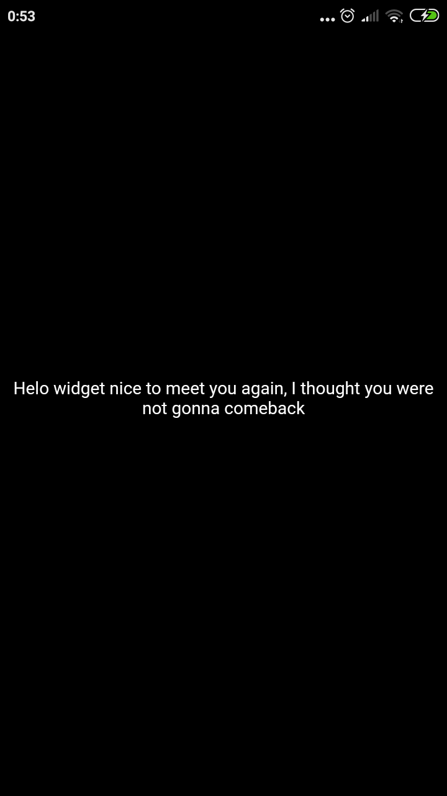
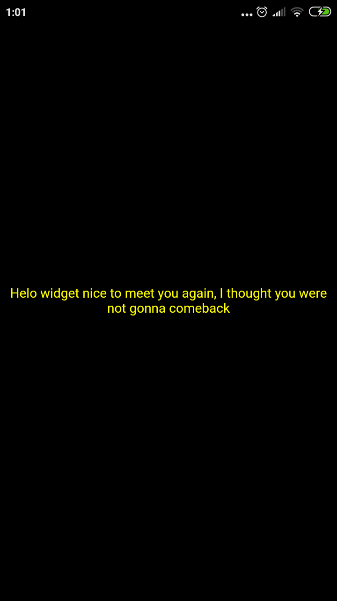
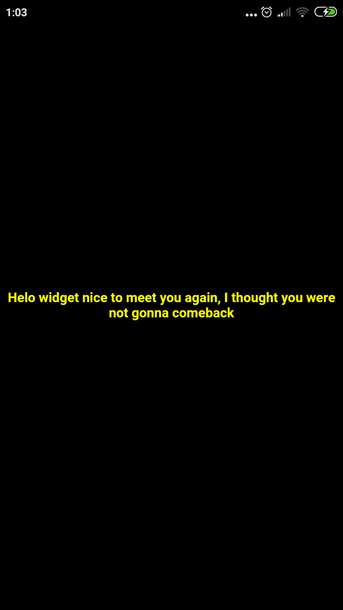

## Get To Know With Widgets and Layout
Flutter widgets are inspirated by React modern framework. Widget describe that their view should look like given their configuration and state. When the widget's state changem the widget rebuil its description.

```dart
import 'package:flutter/material.dart';

void main() {
  //runApp function
  runApp(
      //Center is a widget with child as a widget to
      //Center widget means that text 'Hello widget' will end in the center of screen
      Center(
    child: Text(
      'Helo widget nice to meet you again, I thought you were not gonna comeback',
      //TextDirection.ltr means left-to-right
      // must have textDirection in every Text Widget ???
      textDirection: TextDirection.rtl,
      textAlign: TextAlign.center,
      style: TextStyle(color: Colors.yellowAccent, fontWeight: FontWeight.bold),
    ),
  ));
}
```
### Text
The Text widget is used to display text. You can set the property of Text such as Color, Position, Text, Position and More...

**Play with text widgets**

Edit text..



Add color..



Add style font weight bold..



### Row

A widget that displays its children in a horizontal array. Row widget can't be scroll. If you have just one child, then consider to use Align or Center to position the child.

The runApp() function takes the given Widget and makes it the root of the widget tree. In this example, the widget tree consists of two widgets, the Center widget and its child, the Text widget. The framework forces the root widget to cover the screen, which means the text “Hello, world” ends up centered on screen.

- Stateless Widgets
- Buttons And Statefull Widgets
- Simple Routes Using Statelss Widgets
- Route Using Stateful Widgets
