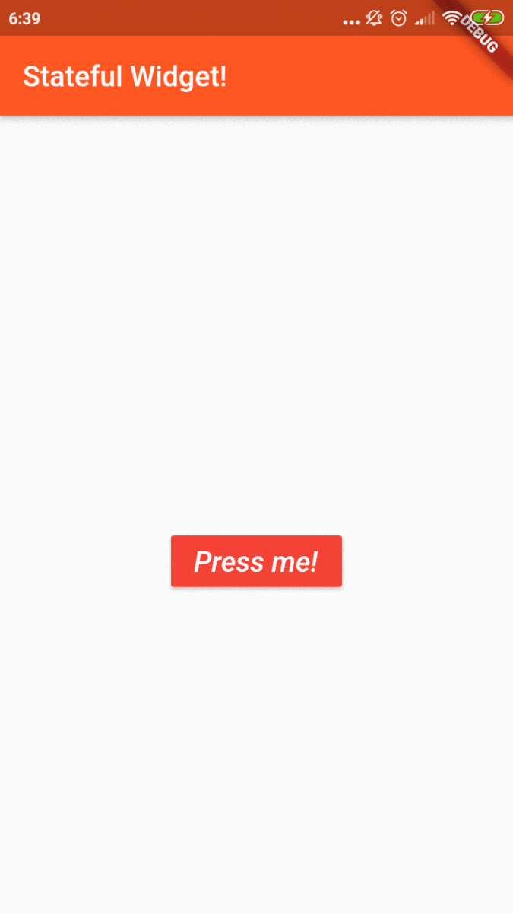

# Buttons And Stateful Widgets

## Stateful Widgets
Statefull Widgets is when a widget change while using the app or cause of interaction with user. 
Example :

- CheckBox
- RadioButton
- Form
- TextField

Stateful Widget overrides the ``createState`` and returns a ``State``. It used when UI can change dynamically.


### Screenshot



## Code Explanation
### Raised Button

Here is Raiseb Button Widget that define information such as ``color``, ``fontStyle``, ``fontSize``, and ``buttonColor`` it self. Button Widget are inside the ``Container``.


```dart
new RaisedButton(
                  child: new Text("Press me!",
                      style: new TextStyle(
                          color: Colors.white,
                          fontStyle: FontStyle.italic,
                          fontSize: 20.0)),
                  color: Colors.red,
                  onPressed: onPressed)
```

### AppBar

Here is the AppBar setup with ``deepOrange`` background color.

```dart
appBar: new AppBar(
            title: new Text("Stateful Widget!"),
            backgroundColor: Colors.deepOrange)
```

### Class AwesomeButtonState
This class is extends from ``State<AwesomeButton>``. As you can see, there is a ``List`` with String Value with the function ``onPressed`` that set to show when the button is pressed. Also there is a ``String displayedString = ""`` That will be fill with the value of the string which called in Text Widget inside the Container.

```dart
class AwesomeButtonState extends State<AwesomeButton> {
  int counter = 0;
  List<String> strings = ["Flutter", "Is", "Awesome"];
  String displayedString = "";

  //you can also declare variables like this
  // var counter = 0;
  // var strings = ["Flutter", "Is", "Awesome"];

  void onPressed() {
    setState(() {
      displayedString = strings[counter];
      counter = counter < 2 ? counter + 1 : 0;
    });
  }
```

### Class AwesomeButton
The class is extends from Statefull Widget

```dart
class AwesomeButton extends StatefulWidget {
  @override
  AwesomeButtonState createState() => new AwesomeButtonState();
}
```

Take your time to check [he code](https://github.com/kmalmaulana/PraxisAcademy/blob/master/novice/02-02/buttons_and_stateful_widgets/lib/main.dart)


