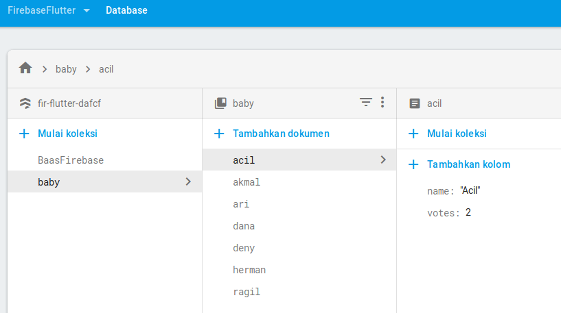
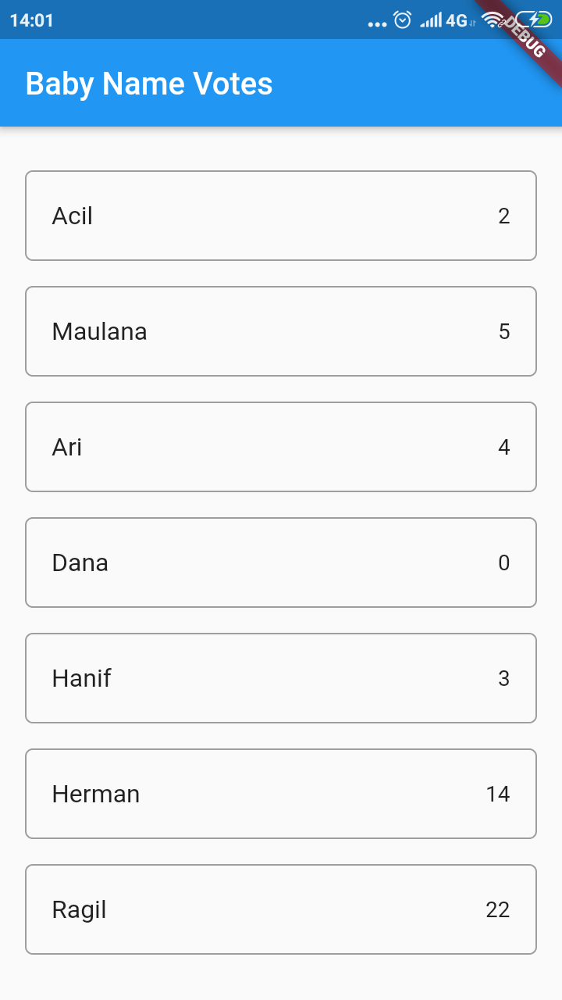

# Mobile Back End as Service
Backend-as-a-Service (BaaS) is a cloud service model in which developers outsource all the behind-the-scenes aspects of a web or mobile application so that they only have to write and maintain the frontend. BaaS vendors provide pre-written software for activities that take place on servers, such as user authentication, database management, remote updating, and push notifications (for mobile apps), as well as cloud storage and hosting.

Mobile-Backend-as-a-Service (MBaaS) is BaaS intended specifically for building apps for mobile. While some sources consider BaaS and MBaaS to be basically interchangeable terms, BaaS services do not necessarily have to be used for building mobile applications.
## Firebase For Mobile
Connecting firebase to App

**Before fetch:**

**Setup firestore database:**

**fetching with firestore database:**

