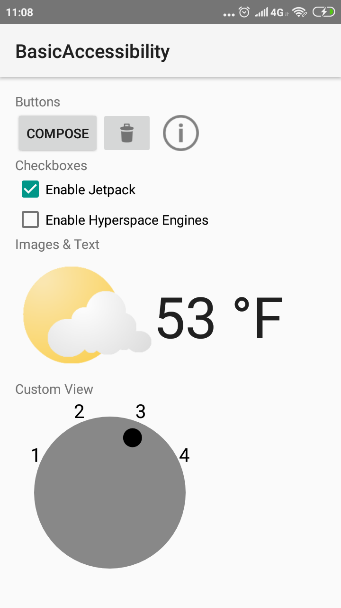
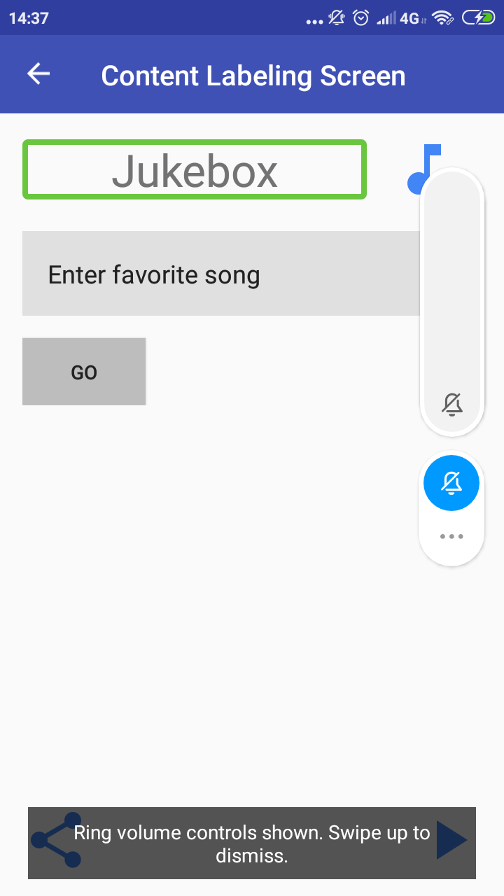
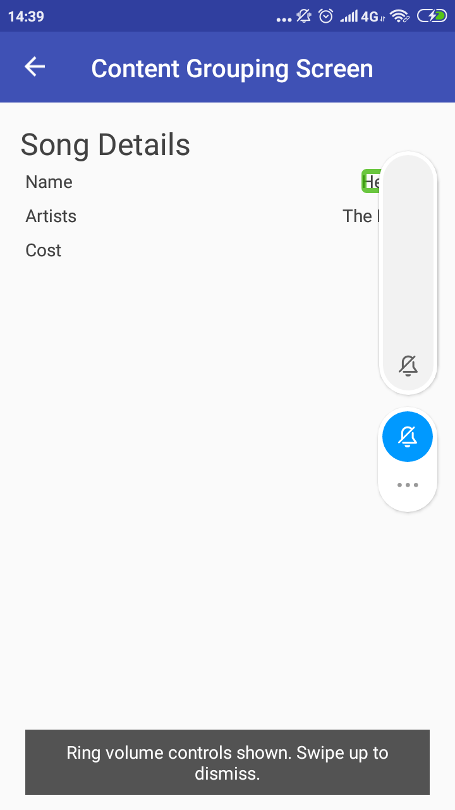
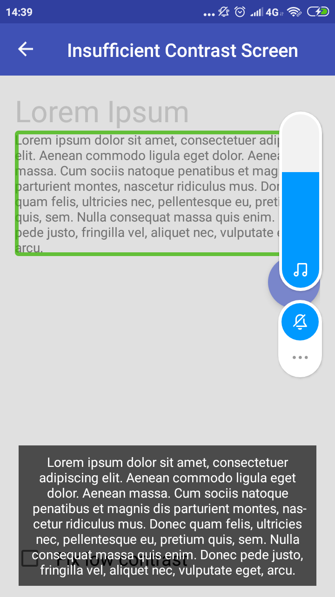
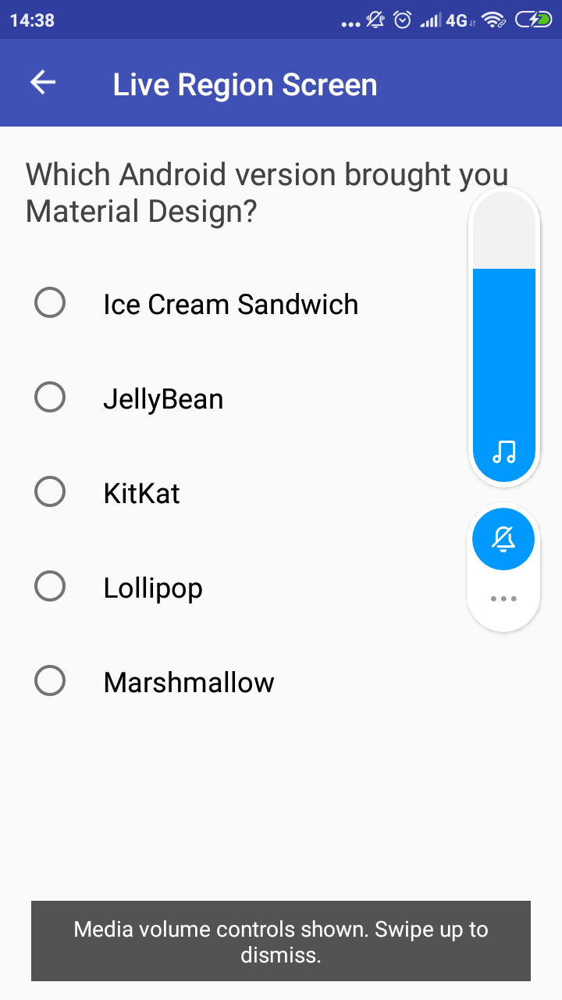

# Accessibility
Accessibility is good for experiences. An Accessibility Service assists users with disabilities in using Android devices and apps. It is a long-running privileged service that helps users process information on the screen and lets them to interact meaningfully with a device.

- Switch Access: allows Android users with mobility limitations to interact with devices using one or more switches.

- Voice Access (beta): allows Android users with mobility limitations to control a device with spoken commands.
    
- Talkback: a screen reader commonly used by visually impaired or blind users.

### Exercize

Here is the example for using basic accessibility. 

**1. Githubrepo**



**2. Codelab1**











**Permission to bind to an accessibility service:**
```dart
<service
    ...
    android:permission = "android.permission.BIND_ACCESSIBILITY_SERVICE">
    ...             
</service>
```


