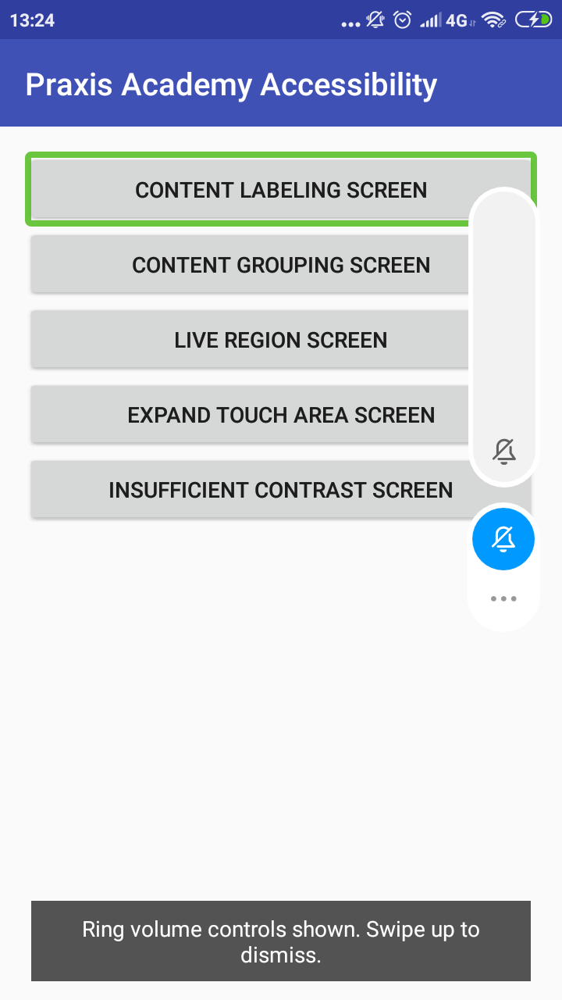

# Accessibility

**Accesibility** here is refers to product design, devices, services, or environments that could be used for disabilities. Design concept that could be accessed and the developing implementation that could procvide a **Direct Access (without any help)** and **Indirect Access** that means compatibility with technology, (for example *Screen Reader*)

If we take a look a Accessibility as "Ability to access" and get some advantages from some system or entity. This concept focus for **posibility access by disabilities**.

### Impact of Accessibility
**Improve your apps reach**
15% from world's(World Bank's research) population is a disability, and they also want to run his live same as a normal people like accessing apps and services to comunicate, learn, work and more. By making your apps accessible, you can reach more users.

**Make your apps versetile**
Accessibility is not only for those people with disabilities. For example, is someone using your apps while take a bath, they can use voice commands to read the incomming messages instead pause the bath to read the messages. **It's very usefull right ??**

So let's jump for creating accessibily for your apps.

## Implement The Accesibility

Here is the [source code](https://github.com/googlesamples/android-BasicAccessibility) for Android Basic Accesibily.

**Here is how it looks when you run it:**

Now let's try access some app as disabilities.
Here is the [steps](https://codelabs.developers.google.com/codelabs/basic-android-accessibility/#2).

**Here is how it looks:**

Google offers an Accessibility Scanner tool that suggests accessibility improvements for Android apps—such as enlarging small touch targets, increasing contrast, and providing content descriptions—so that individuals with accessibility needs can use your app more easily. 
You can download it on App Store

**Here is the result:**

You can see here there is 6 suggestion for developer to complete the accessibility.

When we tap on it, it will show what's the sugestion.

Another suggestion

Thank you.
